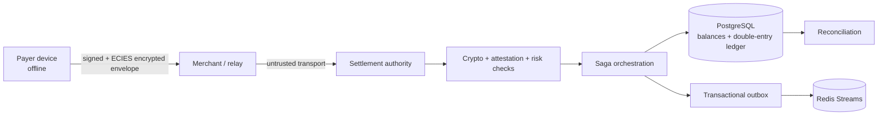
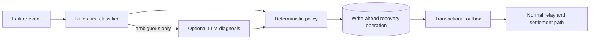

# OfflinePay

OfflinePay is an offline-first payment-intent and proximity-relay prototype. A payer creates a signed, encrypted intent while offline; an untrusted relay forwards it when connected; the settlement authority validates it and atomically settles it later.

> **Scope:** this is not a UPI clone or a real-time offline bank-settlement system. It demonstrates pre-authorized offline tokens with eventual settlement and reconciliation.

## Architecture



### Settlement invariants

* **Single financial authority:** only the settlement Saga can change balances, consume a token, and create ledger entries.
* **Replay resistance:** Redis provides a fast duplicate path; PostgreSQL's unique nonce registry is authoritative.
* **No double spending:** a token state transition and the ledger commit occur in the settlement flow under database locks.
* **Ledger integrity:** each settlement writes debit and credit entries; reconciliation and the financial validator audit them continuously.
* **Durable delivery:** business events are stored in the transactional outbox before Redis publication.

Implementation details and decisions are recorded in [`doc/adr`](doc/adr).

## Bounded failure recovery

Recovery adds diagnosis and scheduling, not a second settlement path:



| Boundary | Enforcement |
| --- | --- |
| AI authority | AI can only classify ambiguous failures. Invalid output or confidence below `0.70` abstains. |
| Financial authority | Recovery never calls a bank API or changes balances, ledger entries, tokens, or nonce records. |
| Retry budget | At most 3 attempts, exponential cooldown, 24-hour recovery window, and 5,000,000 minor-unit cap (₹50,000 for INR). |
| Duplicate workers | One durable operation per transaction; the scheduler claims due rows with `FOR UPDATE SKIP LOCKED`. |
| Retry safety | Retry requests return to the existing relay/settlement flow and cannot bypass crypto, risk, nonce, token, Saga, or reconciliation checks. |

`NETWORK` and `INFRASTRUCTURE` failures may request a retry. `PAYMENT` failures request human compensation review. `SECURITY`, `CONSISTENCY`, unknown, low-confidence, over-budget, and exhausted failures escalate or abstain. See [ADR-011](doc/adr/adr-011-bounded-recovery.md).

## Run locally

### Prerequisites

* Go 1.23+
* Docker and Docker Compose

```bash
docker compose up --build
```

The service is available at `http://localhost:8080`; Prometheus at `http://localhost:9090`; Jaeger at `http://localhost:16686`.

For local development without Compose, set `DATABASE_URL`, `REDIS_ADDR`, and optionally `PORT`, then run:

```bash
go run cmd/server/main.go
```

## API and operations

* OpenAPI contract: [`openapi.yaml`](openapi.yaml), served at `/openapi.yaml`; Swagger UI at `/swagger`.
* Health endpoints: `/live`, `/health`, and dependency-aware `/ready`.
* Versioned API: `/api/v1` (devices, tokens, intents, relay packets, settlement, accounts, attestation, and DLQ operations).
* Reliability exercises: `go run cmd/simulation/main.go`, `go run cmd/replaystorm/main.go`, and `go run cmd/rebuild/main.go`.
* Operational runbooks: [`doc/runbooks`](doc/runbooks).

## Verification

```bash
go test ./...
go vet ./...
go test -run '^$' -bench . ./internal/...
```

The test suite covers cryptographic fuzzing, replay behavior, settlement correctness, ledger checks, transactional outbox behavior, and bounded recovery policy behavior.
