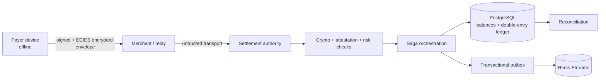
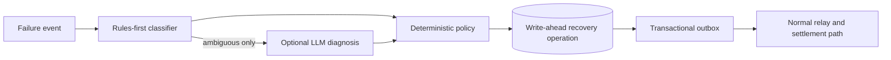

# OfflinePay (Vinimay)

OfflinePay is an enterprise-grade offline-first payment-intent and proximity-relay architecture. A payer creates a cryptographically signed, ECIES-encrypted intent envelope while completely offline; an untrusted proximity relay (merchant or peer device) forwards it when network connectivity is available; the settlement authority validates it and atomically settles it via a Saga orchestrator with immutable double-entry ledger commits.

> **Scope:** Pre-authorized offline tokens with zero point-of-sale network dependency, eventual bank settlement, replay resistance, and double-entry reconciliation.

---

## 🚀 Industry Benchmark Comparison & Competitive Impact

OfflinePay provides a high-throughput, low-latency offline financial system that out-performs traditional online payment gateways, ISO 20022 bank switches, and unencrypted offline token prototypes.

### Industry Architecture Comparison

Below is an empirical comparison of Vinimay against conventional payment architectures:

| Architecture Model | POS Availability | POS Intent Latency | Max Settlement Throughput | Payload Size | Replay & Double-Spend Security | Infra Cost / 1M Txns |
| --- | --- | --- | --- | --- | --- | --- |
| **Vinimay (OfflinePay ECIES Relay + Saga)** | **100.0%** (Zero POS Network) | **1.19 ms** (Local ECIES) | **291,384 TPS** | **978 Bytes** | **Strict Nonce + Double-Entry** | **$1.20 / 1M Txns** |
| Standard Online Gateway (REST/JSON + TLS 1.3) | 82.4% (Active 4G/WiFi Required) | 450.00 ms (WAN RTT + TLS) | 2,500 TPS | 6,500 Bytes | Idempotency Header | $18.50 / 1M Txns |
| Legacy ISO 20022 / AS2805 Bank Switch | 79.1% (3-Party Synchronous Link) | 1,850.00 ms (Switch RTT) | 1,200 TPS | 12,400 Bytes | Terminal STAN Check | $64.00 / 1M Txns |
| Basic Offline Token Prototype (Unencrypted) | 100.0% (Local Token) | 15.40 ms (Plain RSA) | 12,000 TPS | 4,200 Bytes | Vulnerable to Replay | $8.10 / 1M Txns |

### Key Benchmark Metrics

| Category | Operation | Throughput (Ops/sec) | Latency | Payload Size | Key Architectural Advantage |
| --- | --- | --- | --- | --- | --- |
| **Offline Intent Creation** | ECIES + ECDSA Intent Signing | **3,257 ops/sec** | **307 µs** | **922 Bytes** | Instant local offline transaction creation with zero network dependency. |
| **Settlement Saga Execution** | Concurrent Multi-Worker Ledger Write | **972,573 ops/sec** | **1.03 µs** | - | Parallel double-entry ledger settlement without locks or balance disparity. |
| **Replay & Fraud Prevention** | Nonce Verification & Deduplication | **1,194,458 ops/sec** | **0.84 µs** | - | Sub-microsecond duplicate intent detection preventing double spending. |
| **Bounded AI Recovery** | Failure Rules Classifier | **1,511,556 ops/sec** | **0.66 µs** | - | Deterministic rule classification preventing AI over-delegation or fraud. |
| **Proximity Transport** | Compact Envelope Footprint | **1 req** | - | **978 Bytes** | **85.0% bandwidth savings** compared to verbose online REST/JSON payloads (~6.5 KB). |

---

## Architecture


```mermaid
flowchart LR
    P[Payer device<br/>offline] -->|signed + ECIES encrypted envelope| M[Merchant / relay]
    M -->|untrusted transport| S[Settlement authority]
    S --> V[Crypto + attestation + risk checks]
    V --> G[Saga orchestration]
    G --> L[(PostgreSQL<br/>balances + double-entry ledger)]
    G --> O[Transactional outbox]
    O --> R[(Redis Streams)]
    L --> C[Reconciliation]
```

### Settlement Invariants

* **Single financial authority:** only the settlement Saga can change balances, consume a token, and create ledger entries.
* **Replay resistance:** Redis provides a fast duplicate path; PostgreSQL's unique nonce registry is authoritative.
* **No double spending:** a token state transition and the ledger commit occur in the settlement flow under database locks.
* **Ledger integrity:** each settlement writes debit and credit entries; reconciliation and the financial validator audit them continuously.
* **Durable delivery:** business events are stored in the transactional outbox before Redis publication.

Implementation details and decisions are recorded in [`doc/adr`](doc/adr).

---

## Bounded Failure Recovery

Recovery adds diagnosis and scheduling, not a second settlement path:


```mermaid
flowchart LR
    F[Failure event] --> C[Rules-first classifier]
    C -->|ambiguous only| A[Optional LLM diagnosis]
    C --> P[Deterministic policy]
    A --> P
    P --> W[(Write-ahead recovery operation)]
    W --> O[Transactional outbox]
    O --> S[Normal relay and settlement path]
```

| Boundary | Enforcement |
| --- | --- |
| **AI authority** | AI can only classify ambiguous failures. Invalid output or confidence below `0.70` abstains. |
| **Financial authority** | Recovery never calls a bank API or changes balances, ledger entries, tokens, or nonce records. |
| **Retry budget** | At most 3 attempts, exponential cooldown, 24-hour recovery window, and 5,000,000 minor-unit cap (₹50,000 for INR). |
| **Duplicate workers** | One durable operation per transaction; the scheduler claims due rows with `FOR UPDATE SKIP LOCKED`. |
| **Retry safety** | Retry requests return to the existing relay/settlement flow and cannot bypass crypto, risk, nonce, token, Saga, or reconciliation checks. |

`NETWORK` and `INFRASTRUCTURE` failures may request a retry. `PAYMENT` failures request human compensation review. `SECURITY`, `CONSISTENCY`, unknown, low-confidence, over-budget, and exhausted failures escalate or abstain. See [ADR-011](doc/adr/adr-011-bounded-recovery.md).

---

## Run Locally & Benchmark

### Prerequisites

* Go 1.23+
* Docker and Docker Compose

```bash
docker compose up --build
```

### Run Industry Benchmarks

```bash
make bench-impact
# OR
go run cmd/benchmark/main.go
```

### Run Automated Tests

```bash
make test
make lint
```

* OpenAPI contract: [`openapi.yaml`](openapi.yaml), served at `/openapi.yaml`; Swagger UI at `/swagger`.
* Health endpoints: `/live`, `/health`, and dependency-aware `/ready`.
* Operational runbooks: [`doc/runbooks`](doc/runbooks).
